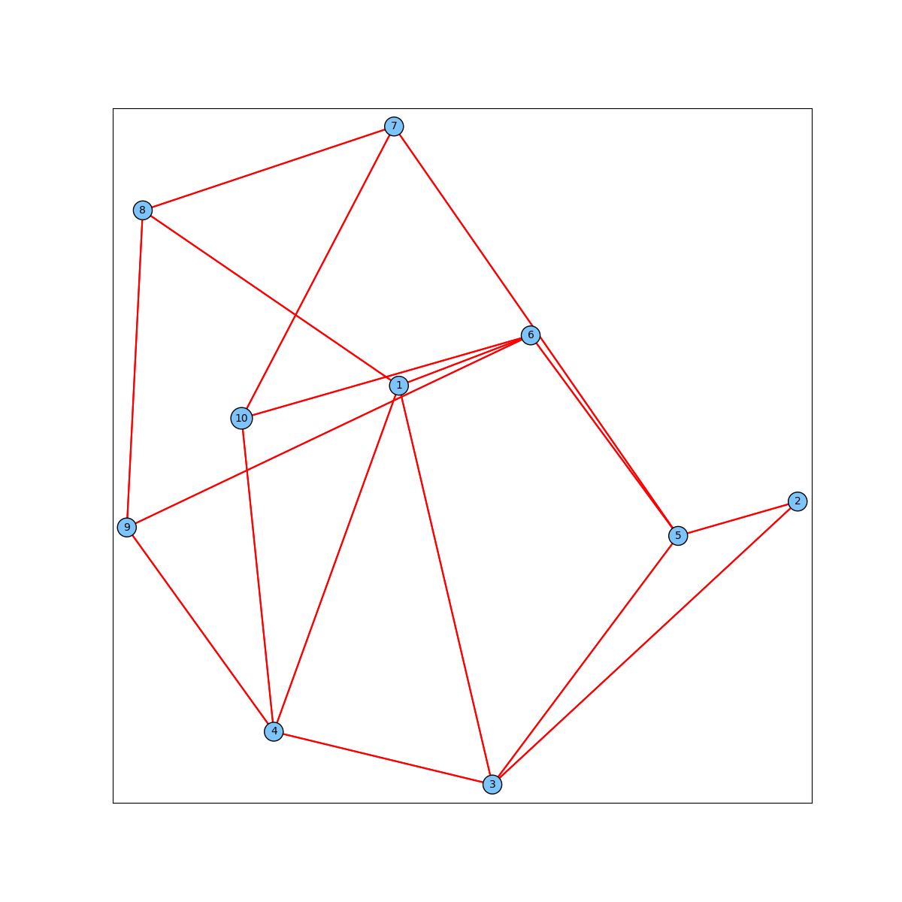

# Задача Графы

Отрисовка графа была сделана с помощью алгоритма Фрюхтермана-Рейнгольда.

Задачи поиска макс. независимого множества была решена двумя способами:
1. Эвристика, решающая задачу за полиномиальное время
2. Точный алгоритм, основанный на динамическом программировании

# Запуск тестов:

```bash
pip install -r requirements.txt
python test.py
```

# Алгоритмы

## Поиск макс. независимого множества

### Эвристика

Жадно выбираем вершину с минимальной степенью, добавляем её в искомое множество и удаляем из графа. Повторяем действия, пока не останется вершин.

Время работы: $O(N \log(N) + M)$, $N, M$ -- количество вершин и рёбер соответственно.

### Точный алгоритм

Динамика по подмножествам.

__dp[mask]__ -- является ли множество вершин, соответствующее __mask__ независимым.

Обновляем динамику, беря одну из вершин маски и смотря, связана ли она с остальными.

Работает за $O(2^N)$.


## Отрисовка графа: алгоритм Фрюхтермана-Рейнгольда

Основан на физической модели пружины. Даёт примерно такие результаты:


